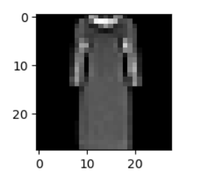

# 👕 FashionMNIST Optimizer Benchmark


**A Deep Learning classification project comparing the efficiency of Neural Network optimizers.**


*(Sample input from the dataset: A Dress processed by the model)*

## 📌 Project Overview

This project implements a Feed-Forward Neural Network (Multi-Layer Perceptron) using **PyTorch** to classify images from the **FashionMNIST** dataset.

The primary goal of this repository is not just to build a classifier, but to demonstrate the impact of different **Optimization Algorithms** on model convergence and final accuracy. The model attempts to categorize grayscale images into 10 classes (T-shirts, Trousers, Dresses, etc.).

## 🧠 Model Architecture

The model is a fully connected network defined as `ClothesClassifier`:


* **Input Layer:** Flattens 28x28 images into a 784-element vector.
* **Hidden Layer 1:** 128 Neurons + ReLU Activation.
* **Hidden Layer 2:** 64 Neurons + ReLU Activation.
* **Output Layer:** 10 Neurons (one for each class).

## 🧪 Experiments & Results

The project trains the same model architecture for **2 Epochs** using three different configurations to observe loss reduction.

| Optimizer | Learning Rate | Momentum | Final Loss (2 Epochs) | Convergence Speed |
| :--- | :--- | :--- | :--- | :--- |
| **SGD** | 0.001 | None | ~2.042 | 🐌 Slow |
| **SGD + Momentum** | 0.001 | 0.9 | ~0.556 | 🏃 Fast |
| **Adam** | 0.001 | N/A | **~0.409** | 🚀 Fastest |

**Final Evaluation (Adam):**
* **Accuracy:** 85%
* **Precision (Class 1 - Trouser):** 98%
* **Precision (Class 6 - Shirt):** 64% (Most difficult class)

## 🛠️ Technologies Used

* **PyTorch:** Neural Network construction and training.
* **Torchvision:** Dataset downloading and image transformations.
* **Matplotlib / Seaborn:** Visualization.
* **Scikit-Learn:** Generating the Classification Report.

## 🚀 How to Run

1.  **Clone the repository**
    ```bash
    git clone [https://github.com/yourusername/FashionMNIST-Optimizer-Benchmark.git](https://github.com/yourusername/FashionMNIST-Optimizer-Benchmark.git)
    ```

2.  **Install dependencies**
    ```bash
    pip install torch torchvision matplotlib seaborn scikit-learn
    ```

3.  **Run the Notebook**
    ```bash
    jupyter notebook "FashionMNIST Optimizer Benchmark.ipynb"
    ```

## 📂 File Structure

* `FashionMNIST Optimizer Benchmark.ipynb`: The main training and evaluation script.
* `data/`: Folder containing the downloaded FashionMNIST dataset.
* `sample_dress.png`: Visualization of a sample input.
